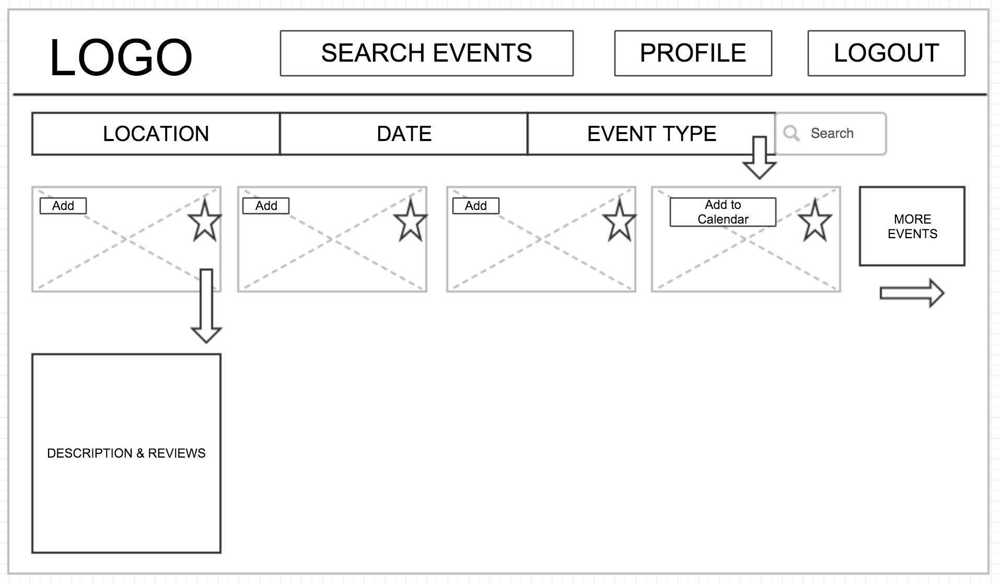
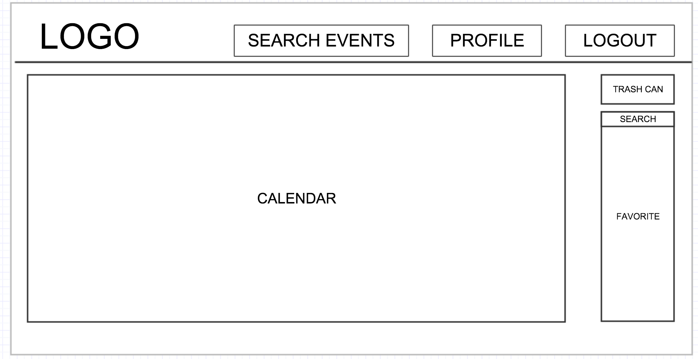
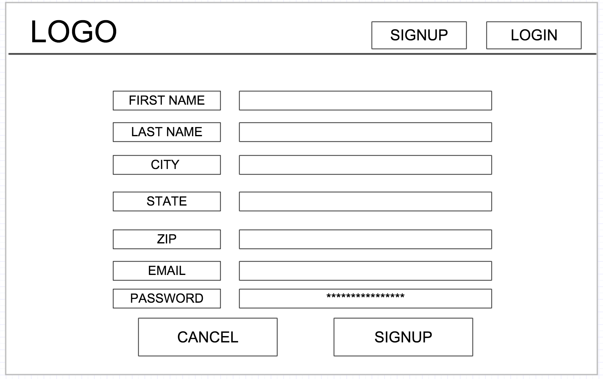
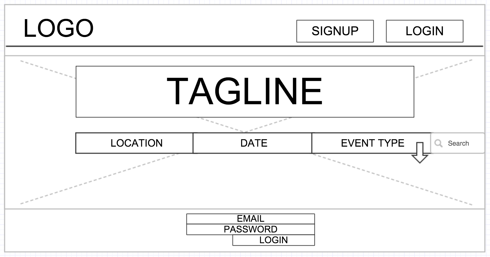
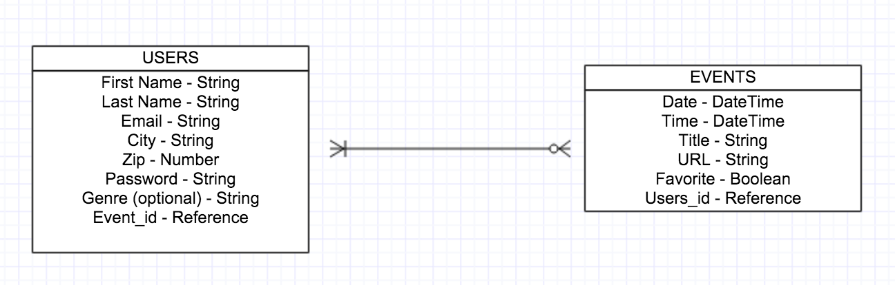

# Event Calendar

## Synopsis
Event Calendar is an app that is targeted towards people looking for events in the area. How it works:  
 * Search events based on location, date, and type of event
 * Once search is complete the page will populate with five events that meet the search criteria with the option of searching through more events if the user desires
 * User will have the ability to click on the event picture to see a dropdown that will include a brief Yelp description and a few recent reviews
   * If the event is music related, Soundcloud will provide a sample of the music
 * User will be able to add an event to their calendar and/or add the event to their favorites
 * User profile page will include a calendar of all events they have added and a favorites board that will show any events that the user has favorited
 * Users will be able to delete, drag and drop (edit), and view events including event details on their calendar
 * User can share an event to their Facebook wall  
[Trello Board](https://trello.com/b/reVEs9vo/les-developpeurs)

## Motivation

This is project 3 of our WDI course.

## Installation
* Download the zip file or clone this repo to your local computer.
* Cd inside the root of the directory and run 'npm install'
* You will need to get API keys for SoundCloud, Eventful, and Yelp and setup the correct environment variables to make the APIs functional.

## API Reference
We are using the following APIs:
* Eventful
* Yelp
* SoundCloud

## Contributors

*Gabriel Schnall*
*Laura Leonard*
*Reid Crawford*

## Wire Frames

### Main Page

### Profile Page

### Signup Page

### Login Page

## Models

## License

A short snippet describing the license (MIT, Apache, etc.)
